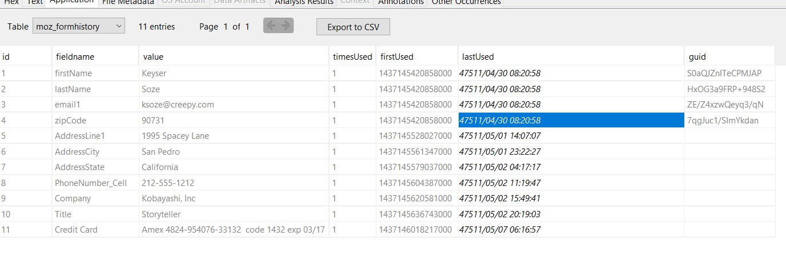
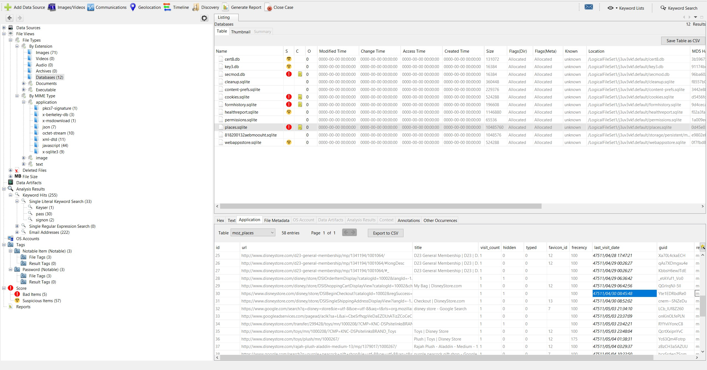
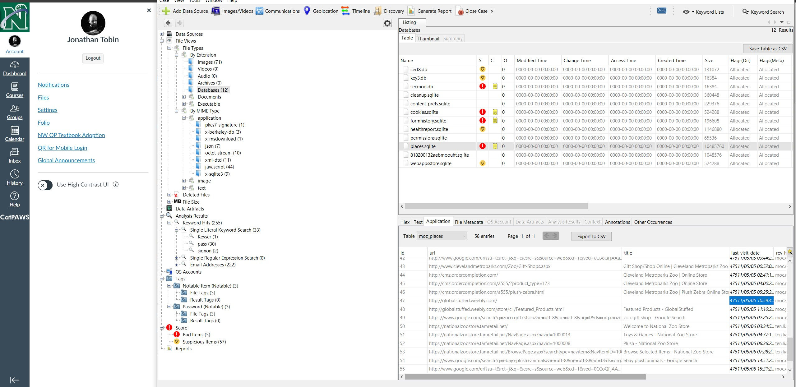
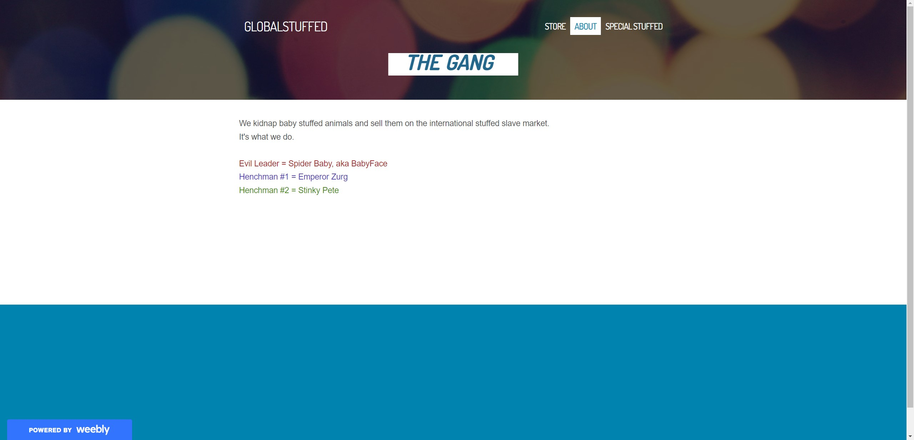
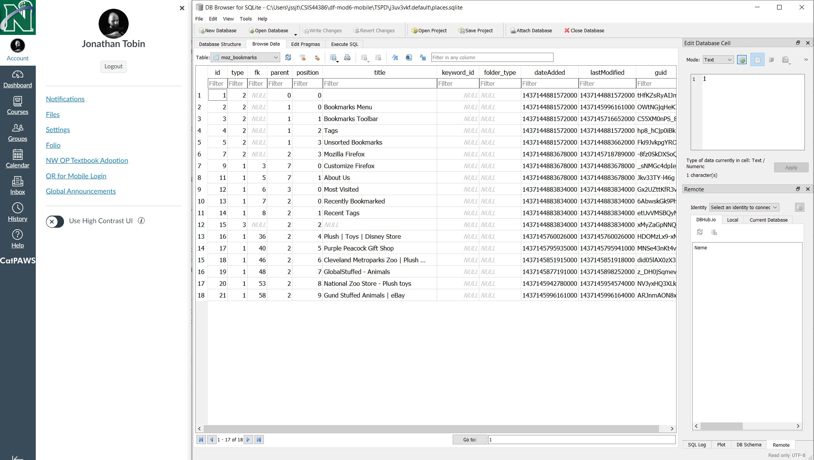

# df-mod6-mobile-post
Post for the class df-mod6-mobile fork to make it easier to navigate

### This is a partner repo to the class assignment fork, located here: https://github.com/JSSJT/df-mod6-mobile

## Part 1

- I used the portable DB Browser for SQLite to look through the firefox tables.  This was mostly a manual process.  Some of them have relatively exlanatory names (cookies, places, etc.)
- I also used Autopsy so that I could back-and-forth compare.
  
### FormHistory.sqlite  contained what appears to be the purchase information
  - Name and email last entered into a site on 30-Apr-2011 08:20:58
  - Payment info last entered 01/02-May-2011
  - Credit card entered 07-May-2011
  

### places.sqlite indicated around this time a purchase was being made on the disney.com storefront

 - Also weebly, an online storefront hosting platform was visited.  Specifically globalstuffed.weebly.com, which apprently advertises that they trade on the open stuff slave market.

#### the user also has many stuffed/plush sites in their bookmarks, including a the nefarious Global Stuffed.

